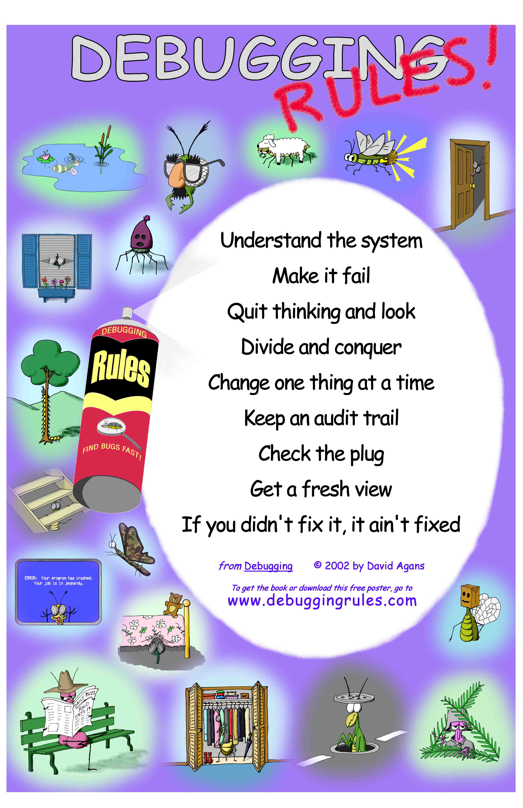

# Debugging Rules
Source: <http://www.debuggingrules.com>

## Understand the system
Read the manual, read everything in depth, know the fundamentals, know the road map,
understand your tools, and look up the details.

## Make it fail
Do it again, start at the beginning, stimulate the failure, don’t simulate the failure,
find the uncontrolled condition that makes it intermittent, record everything and find the signature of
intermittent bugs, don’t trust statistics too much, know that “that” can happen, and never throw away a debugging tool.

## Quit thinking and look
(get data first, don’t just do complicated repairs based on guessing):
See the failure, see the details, build instrumentation in, add instrumentation on, 
don’t be afraid to dive in, watch out for Heisenberg, and guess only to focus the search.

## Divide and conquer
Narrow the search with successive approximation, get the range, determine which side of the bug you’re on,
use easy-to-spot test patterns, start with the bad, fix the bugs you know about, and fix the noise first.

## Change one thing at a time
Isolate the key factor, grab the brass bar with both hands (understand what’s wrong before fixing),
change one test at a time, compare it with a good one, and determine what you changed since the last time it worked.

## Keep an audit trail
Write down what you did in what order and what happened as a result,
understand that any detail could be the important one, correlate events,
understand that audit trails for design are also good for testing, and write it down!

## Check the plug
Question your assumptions, start at the beginning, and test the tool.

## Get a fresh view
Ask for fresh insights (just explaining the problem to a mannequin may help!),
tap expertise, listen to the voice of experience, know that help is all around you,
don’t be proud, report symptoms (not theories), and realize that you don’t have to be sure.

## If you didn’t fix it, it ain’t fixed
Check that it’s really fixed, check that it’s really your fix that fixed it,
know that it never just goes away by itself, fix the cause, and fix the process.
